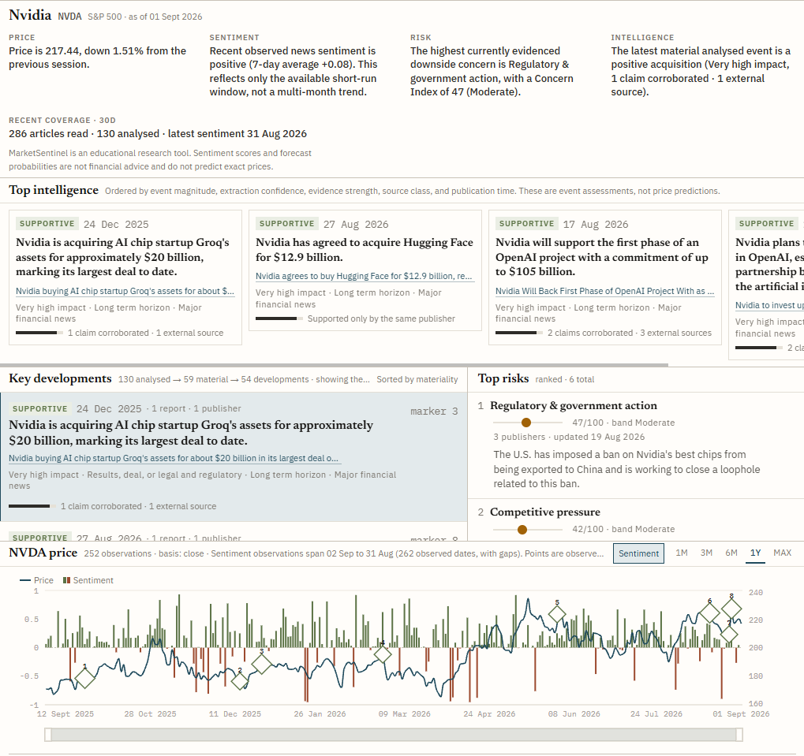
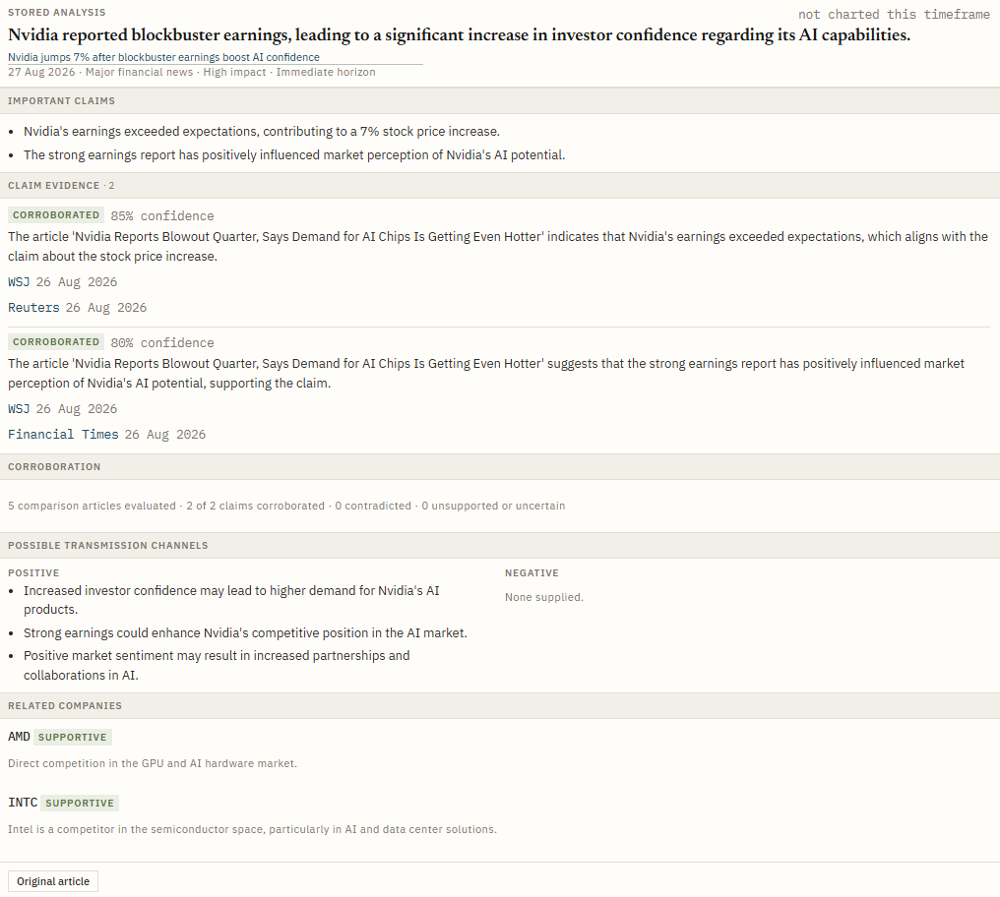
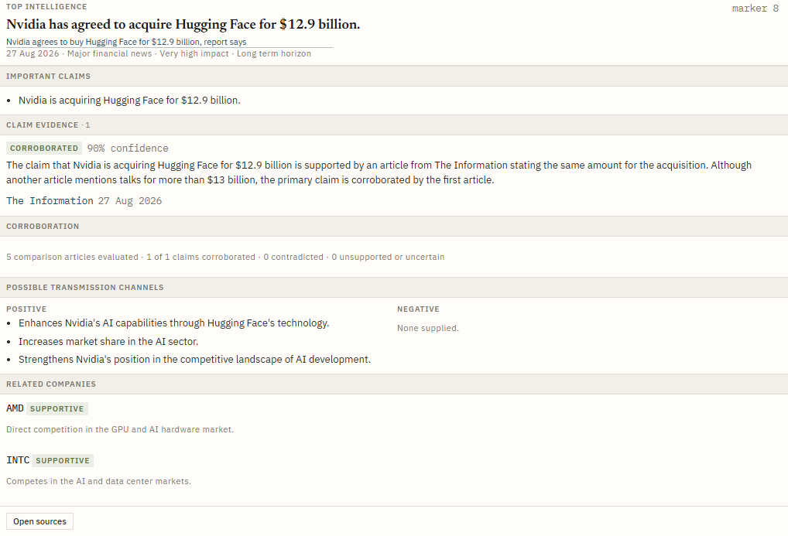
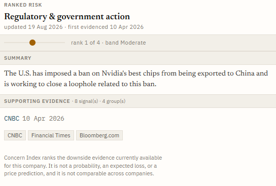
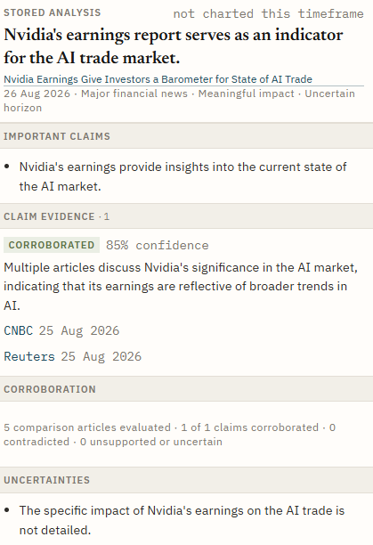
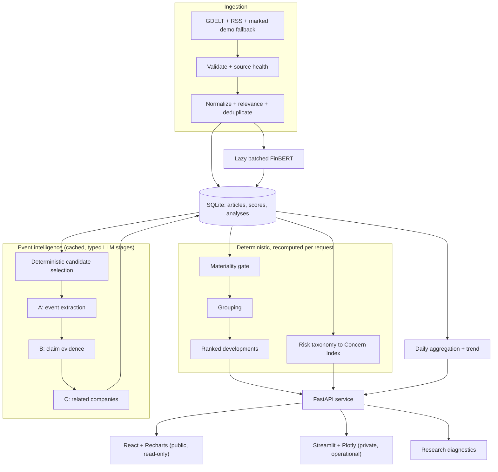

# MarketSentinel

[](https://github.com/AlfredHong2006/MarketSentinel/actions/workflows/ci.yml)
[](LICENSE)
[](https://www.python.org/downloads/)

**Evidence-grounded company intelligence from financial news, corporate events, and market data.**

Point MarketSentinel at any S&P 500 or FTSE 100 company and it answers the question a tone score
cannot: *what actually happened to this business, and how well is it evidenced?* Hundreds of
headlines become a short, auditable list of **material developments** — each a typed corporate
event, merged across syndicated reporting, passed through a four-condition materiality gate, and
annotated with the publishers that corroborated it.

**125-row hand-labelled evaluation** · **raw gate P 0.907 / R 0.942** · **0 unexplained
disagreements** (in-sample) · **832 deterministic tests** · **evaluation runs offline from a fresh
clone**



*One company, one screen. The four market-view statements stay **separate** rather than being fused
into a score; 130 analysed articles compress to 54 developments; and the chart carries price as a
continuous line, daily sentiment as diverging bars, and numbered markers for the events that clear
the shared materiality floor. Sentiment points are **observed only** — dates with no coverage are
absent, never interpolated to neutral.*

---

## What it does

| Surface | What you get |
| --- | --- |
| **Current Market View** | Price move, recent observed sentiment, the highest evidenced downside concern, and the latest material event — four separate statements, not a verdict. |
| **Key Developments** | The strongest material developments, ranked. One row is one *underlying event*, not one article. |
| **Top Intelligence** | The evidence behind each event: corroborating publishers, transmission channels, related companies, full stored analysis. |
| **Top Risks** | Downside themes ranked by a bounded 0–100 **Concern Index**, each backed by named signals, publisher counts, and a dated link. |

> **Not financial advice.** An educational portfolio project. Nothing here is a price prediction,
> a calibrated probability of an investment outcome, or a recommendation.

---

## Why this is not just sentiment analysis

Most "AI market sentiment" projects stop at *headline → FinBERT → average tone → line chart*.
That pipeline has three well-known failure modes, and MarketSentinel is built around fixing them.

| Failure mode of tone-only dashboards | What MarketSentinel does instead |
| --- | --- |
| **Tone is not an event.** "Nvidia shares slip 3%" and "Nvidia loses a $10bn contract" can score identically, yet only one changes the business. | Extracts a **typed event** — acquisition, regulation, litigation, supply disruption — with direction, magnitude, and a persistence horizon. Market reactions cannot stand in as the underlying event. |
| **Volume is mistaken for signal.** One story syndicated by 20 outlets looks like 20 confirmations, inflating any average. | **Groups** duplicate reporting into a single row, and scores each risk theme by its **strongest signal plus a capped corroboration bonus — never an open-ended sum**. |
| **Nothing is falsifiable.** A blended 0–100 "sentiment score" cannot be argued with. | Every verdict is a set of **auditable booleans**, and a rejected article names the condition that failed. The gate is scored against a hand-labelled gold corpus with published precision and recall. |

Two rules run through the codebase. **Corroboration is conservative:** only the articles a claim
actually *cited* count, deduplicated to distinct publishers. They are called **external** sources,
not *independent* ones — nothing in the stored data establishes editorial independence. **Nothing
is imputed:** missing sentiment dates stay absent, and an HTTP 200 carrying no valid records is
reported as *degraded*.

---

## Pipeline

| Stage | What happens | Implementation |
| --- | --- | --- |
| **1. Ingest** | GDELT DOC 2.0 backfill plus recent Google News RSS, with a date-bounded fallback only when GDELT accepts nothing. Deduplication uses provider IDs, canonical URLs, or identical normalized title + publisher within six hours — never fuzzy matching. | [sources/historical.py](src/marketsentinel/sources/historical.py), [normalization.py](src/marketsentinel/normalization.py) |
| **2. Event extraction** (Stage A) | A typed LLM call extracts one business event per article: type, direction, magnitude, horizon, and transmission channels. Article text is **untrusted data** — embedded instructions are never followed, and predictions never become established facts. | [event_analysis.py](src/marketsentinel/event_analysis.py) (`event-extraction-v7`) |
| **3. Evidence** (Stage B) | Claims are assessed **only** against supplied stored articles from a temporally bounded window; pretrained knowledge is not evidence. Each returns corroborated / contradicted / unsupported / uncertain plus the article IDs it cited. | [event_analysis.py](src/marketsentinel/event_analysis.py) (`claim-evidence-v1`) |
| **4. Materiality gate** | Four deterministic conditions in order — **guard** (not commentary or a price move), **driver** (names a real cash-flow or risk driver), **durability** (persists beyond the news cycle), **evidence** (qualifying source class, external support, or first-hand disclosure). The first failure is recorded by name; a *contradicted* claim never rejects a row, the dispute is attached instead. | [materiality.py](src/marketsentinel/materiality.py) |
| **5–6. Grouping and ranking** | Material events merge by transitive same-development similarity (shared anchor terms and title overlap), so several reports of one event become one row represented by its strongest member. Groups are then ordered **lexicographically, never blended**: magnitude leads, event-class tier breaks ties, evidence breadth breaks the rest. | [materiality.py](src/marketsentinel/materiality.py) (`group_material_events`, `prepare_key_developments`) |
| **7. Risks** | Stored events map through a fixed downside taxonomy — no embeddings, no fuzzy matching, no LLM classifier — into a bounded 0–100 Concern Index per theme from severity, evidence support, and persistence-aware recency decay. Unrecognised mechanisms become `UNMAPPED`. | [risk_taxonomy.py](src/marketsentinel/risk_taxonomy.py), [risk_signals.py](src/marketsentinel/risk_signals.py), [risk_scoring.py](src/marketsentinel/risk_scoring.py) |

**Nothing in stages 4–7 is persisted.** Verdicts, groups, and rankings recompute from stored
analyses on every request, so a policy change needs no migration and no re-analysis.

A third LLM stage (`related-company-v5`) proposes related-company effects, but only from a supplied
candidate list and only where a concrete, event-specific transmission mechanism exists — shared
sector membership is insufficient.

---

## Key Developments

Each row is one underlying development, with **Impact**, **Direction**, **Persistence**, and
**Corroboration** stated separately rather than fused into one number. A group of several reports
collapses to one row (`1 report · 1 publisher`, or more where syndication was merged). Two details
worth noting in the overview above:

- The funnel caption (`130 analysed → 59 material → 54 developments · showing the strongest 8`)
  states what was examined, what passed the gate, and how many rows grouping merged away. These are
  **live-database** figures from the moment of capture, deliberately larger than the frozen 125-row
  evaluation snapshot below — the corpus kept collecting after the gold labels were frozen.
- Corroboration is stated per row, so a well-evidenced development and a single-publisher one do
  not look alike.

---

## The evidence behind a claim



Selecting anything on the page opens its **stored analysis** — the audit trail that makes a verdict
arguable. Each extracted claim carries its own status and confidence, and lists the *specific*
articles that supported it (`WSJ`, `Reuters`, `Financial Times`), not a count. The corroboration
line reconciles exactly: `5 comparison articles evaluated · 2 of 2 claims corroborated ·
0 contradicted · 0 unsupported or uncertain` — comparison material examined is reported separately
from support actually found. Transmission channels and related companies each state a concrete
mechanism rather than a sector label, and **Original article** links back to the source.

---

## Top Intelligence



The most material stored analyses, ranked by magnitude, extraction confidence, evidence strength,
source class, then publication time — an ordering the UI states rather than hides. The detail shows
why a claim is believed: here a single cited source at 90% confidence, with the reasoning noting
that a competing article gave a different figure. `marker 8` ties the row to its numbered point on
the chart, so the timeline and the evidence are the same object.

---

## Top Risks



Stored events map through a **fixed taxonomy** into ranked downside themes. Each theme carries the
mechanism in one sentence, how many signals support it, how many event groups they span, the dates
it was first and last evidenced, and the publishers behind it.

> The **Concern Index** is an evidence-weighted salience ranking. It is not a probability, an
> expected loss, or a price prediction, and it is not comparable across companies. The UI says so
> too.

---

## Relevant News drills into the stored analysis



Below the chart, **Relevant News** lists every stored article for the company across the full
366-day window — filterable by date, source, sentiment, and whether it was analysed. A row marked
*Analysed* opens **the persisted claim/evidence analysis for that article**, without leaving the
page and without generating anything new: the record shown was produced once and stored, so opening
it costs nothing and always returns the same verdict.

That makes the corpus browsable rather than merely summarised — a reader can start from any single
headline and reach the same audited structure the ranked surfaces are built from. Note the
**Uncertainties** section: what the extraction could *not* establish is surfaced, not hidden, and
`Original article` remains a separate link out to the publisher.

---

## Evaluation

The materiality gate is scored against a **frozen, hand-labelled gold corpus** committed at
[tests/fixtures/nvda_materiality_gold.json](tests/fixtures/nvda_materiality_gold.json) — a labelled
*snapshot*, not a live view of the database. The live corpus grows; the snapshot does not.

**These are in-sample regression figures, not out-of-sample validation.** The gate's thresholds and
vocabulary were developed against this same corpus, so they pin behaviour against regression but do
**not** show that the gate generalises to other tickers, sectors, or regimes.

| Corpus (NVDA, frozen 2026-08-26) | | Gate performance (raw) | |
| --- | --- | --- | --- |
| Labelled stored analyses | **125** | Gate precision | **0.907** |
| Gold-labelled material | **52** | Gate recall | **0.942** |
| Gate calls material | **54** | Grouping precision (pairwise) | **1.000** |
| Distinct developments after grouping | **49** | Grouping recall (pairwise) | **0.778** |
| | | **Unexplained disagreements** | **0** |

Raw confusion: `tp 49 | fp 5 | fn 3 | tn 68`. Grouping is scored pairwise over the rows gold and the
gate both call material: 9 gold pairs, 7 predicted.

### Against naive baselines on the same labels

| Selector | Precision | Recall |
| --- | --- | --- |
| **Materiality gate** | **0.907** | **0.942** |
| Meaningful-event floor | 0.526 | 0.981 |
| Top-N by magnitude, then confidence | 0.630 | 0.654 |

The meaningful-event floor selects nearly twice as many rows as the gate (97 against 54) and
produces roughly nine times the false positives (46 against 5); ranking by magnitude alone loses
both precision and recall. The gate's *structure* — not merely having an LLM in the loop — produces
the separation.

**The pass criterion is explanation, not a threshold.** Every false positive, false negative, and
missed grouping pair must be named in `known_disagreements` with a reason; `unexplained
disagreements: 0` is the result that matters, and the numeric tripwires are secondary.[^adjusted]

[^adjusted]: Excluding the 10 disagreements documented with named reasons in the fixture, all four
figures reach 1.000. That is an argument about which errors were knowingly accepted — not evidence
they did not happen — so the raw figures stay the headline.

---

## Architecture and engineering



### Two clients, one set of conclusions

| | **React** (`frontend/`) | **Streamlit** (`dashboard.py`) |
| --- | --- | --- |
| Purpose | The polished public read experience | Private/local operational surface |
| HTTP verbs | **GET only — no write client exists** | GET + the two POSTs |
| Can refresh coverage / run analysis | No | Yes |
| Deployed as | Public demo | Run locally |

Both read the same endpoints and render the same server-owned conclusions. **Neither re-derives
materiality, grouping, ranking, or corroboration** — [frontend/src/api/types.ts](frontend/src/api/types.ts)
mirrors `domain.py` field for field and adds nothing, so which rows are developments, in what
order, and with what labels all arrive already decided.

**Public mode** (`MARKETSENTINEL_PUBLIC_MODE=true`) closes exactly one thing: the two endpoints
that spend money return `404`, enforced at the API boundary rather than by hiding a button. Search
and every read stay open across the **full S&P 500 / FTSE 100 universe** — a public deployment is
genuinely searchable, not narrowed to a demo pair. `/api/v1/capabilities` reports the raw stored
article count per ticker so results can be labelled *Prepared coverage · N articles*, *N stored
articles*, or *No stored coverage*; a supported company with nothing stored yet renders an honest
empty state rather than a 404, and skips the price fetch entirely.

`NVDA` and `PFE` are simply the two companies with deliberate deep backfill — an editorial label,
not an allowlist and not a computed quality score.

A `src/` layout with explicit boundaries (abridged — key modules only):

```text
src/marketsentinel/
├── aggregation/            # Daily sentiment and moving averages
├── api/                    # FastAPI boundary and dependency wiring
├── forecasting/            # Chronological five-session baseline (diagnostic)
├── sentiment/              # Lazy FinBERT service
├── sources/                # GDELT, RSS, and market-data adapters
├── storage/                # SQLite repository
├── analysis_candidates.py  # Deterministic article selection
├── event_analysis.py       # Three-stage typed LLM intelligence
├── materiality.py          # Gate, grouping, ranking
├── risk_taxonomy.py        # Event to downside-theme mapping
├── risk_signals.py         # Risk-signal extraction
├── risk_scoring.py         # Bounded Concern Index aggregation
├── dashboard*.py           # Streamlit client and pure view models
├── overview.py             # Typed Company Overview projection for non-Python clients
├── domain.py               # Pydantic domain contracts
└── service.py              # End-to-end orchestration

frontend/                   # React + Vite public read client
└── src/
    ├── api/                # Typed mirror of domain.py + GET-only client
    ├── components/         # Panes: chart, developments, risks, relevant news, detail
    └── ds/                 # Vendored design tokens
```

- **Deterministic where it matters.** Stages 4–7 contain no LLM call, no embedding, and no fuzzy
  match, so the same stored analyses always produce the same developments, groups, and ranking.
- **View preparation is pure.** The `dashboard_*.py` modules take payloads and return view models,
  making every rendered surface unit-testable without Streamlit.
- **LLM output is a typed contract.** All three stages use structured outputs validated against
  Pydantic models, and the cache key includes prompt and schema version, so a version bump
  invalidates cleanly.
- **Failure is visible.** Source health distinguishes healthy, degraded, and failed; demo fallbacks
  are labelled synthetic, never presented as real news.

### Sentiment index

FinBERT returns positive/negative/neutral probabilities. For headline `i`, age `a_i` in hours,
relevance `r_i`, half-life `h` (24h default), and probability entropy `H(p_i)`:

```text
s_i          = P(positive_i) - P(negative_i),  -1 <= s_i <= 1
confidence_i = 1 - H(p_i) / log(3)
lambda       = log(2) / h
w_i          = r_i * confidence_i * exp(-lambda * a_i)
S_t          = sum(w_i * s_i) / sum(w_i)
```

Probability indices are read from `model.config.id2label` rather than assuming label order, with a
regression test pinning that historically error-prone boundary. `S_t` is a derived index over
observed dates, not a probability of price movement.

### Baseline forecast (research diagnostic)

A five-trading-day direction baseline sits inside the collapsed **Research diagnostics** expander.
It is not a headline feature: it exists to demonstrate leakage-safe time-series handling, not to
predict prices.

The target at session `t` is `y_t = 1 if adjusted_close_(t+5) > adjusted_close_t else 0`, and
features use only information available at `t`. A regularized logistic regression is validated
chronologically on the **newest 20% (minimum 30 sessions)** of labelled observations with a
**five-session purge** between training and validation, and daily sentiment is assigned to the
*next* observed trading session so an after-close headline cannot become a same-close feature.
Training-majority and trailing-momentum baselines sit beside it.

**The output probability is not calibrated.** Proper evaluation would need walk-forward splits,
calibration, multiple regimes, cost-aware decision rules, and a licensed historical sentiment
dataset. See [forecasting/baseline.py](src/marketsentinel/forecasting/baseline.py).

---

## Reproducibility

The gold fixture is committed, so **the evaluation runs from a fresh clone with no database and no
network access**:

```bash
uv run python scripts/evaluate_materiality.py evaluate --no-drift-check
```

That prints the raw confusion matrix, both baselines, every documented disagreement with its
reason, the threshold checks, and — in the tool's own output — the reminder that these are
in-sample regression figures.

**The live-DB drift check is optional.** Adding a database compares every labelled row field by
field against the stored analysis it was labelled from:

```bash
uv run python scripts/evaluate_materiality.py evaluate --database data/marketsentinel.db
```

This reports `FAIL` once the database has collected or re-analysed articles the frozen fixture does
not cover. **That is the drift check working as designed, not a broken gate** — a gold set that
silently disagrees with a re-analysed corpus measures nothing. The `--no-drift-check` form above is
the reproducible one.

Tests inject fake providers and a static sentiment backend, so the suite is **deterministic and
never touches the network or downloads model weights**:

```bash
uv run ruff check .
uv run ruff format --check .
uv run pytest --cov=marketsentinel --cov-report=term-missing
```

**832 tests pass** with lint and formatting clean; CI runs all three on every push and pull request
against a locked dependency set. Coverage spans FinBERT label mapping, normalization and
deduplication, SQLite round-trips, chronological forecast targets, the three-stage analysis
contracts, risk scoring, the materiality gate and grouping, the gold-census harness, and the full
service orchestration path.

---

## Setup

Requirements: [uv](https://docs.astral.sh/uv/) and Python 3.11.

```bash
git clone https://github.com/AlfredHong2006/MarketSentinel.git
cd MarketSentinel
uv sync --all-extras --dev
cp .env.example .env          # Windows: Copy-Item .env.example .env
```

`--all-extras` matters: PyTorch/transformers (FinBERT) and Streamlit live in the `ml` and
`dashboard` extras rather than in the base dependencies, so that the public read-only deployment
— a GET-only API that never scores sentiment and never imports the Streamlit client — installs
neither PyTorch nor the ~3 GB of CUDA wheels it pulls in on Linux. A plain `uv sync` gives you
the API only.

Then start the API and dashboard — on Windows, one script runs both:

```powershell
.\scripts\run_local.ps1
```

On macOS or Linux, run the two processes directly:

```bash
uv run uvicorn marketsentinel.api.app:app --host 127.0.0.1 --port 8000 &
uv run streamlit run src/marketsentinel/dashboard.py --server.port=8501
```

Streamlit dashboard at `http://localhost:8501`; API docs at `http://127.0.0.1:8000/docs`.

To run the React client (Node 18+), against the same API:

```bash
cd frontend
npm install
npm run dev          # http://localhost:5173
```

It needs no key and writes nothing. Point it elsewhere with `VITE_API_BASE_URL`, and add that
origin to `MARKETSENTINEL_CORS_ALLOW_ORIGINS`. To preview the public read-only behaviour, start the
API with `MARKETSENTINEL_PUBLIC_MODE=true`.

The first analysis with unscored articles downloads the public `ProsusAI/finbert` model and takes
longer; it loads once per API process and needs no Hugging Face token. **Event intelligence
(stages A–C) is optional** — without `MARKETSENTINEL_LLM_API_KEY` the app runs normally and the
intelligence surfaces stay empty rather than failing.

### Configuration

Settings use the `MARKETSENTINEL_` prefix and may be placed in `.env`. The ones worth knowing:

| Setting | Default | Purpose |
| --- | --- | --- |
| `LLM_API_KEY` | unset | Enables the three typed article-intelligence stages |
| `LLM_MODEL` | `gpt-4o-mini` | Model used by all three stages |
| `ANALYSIS_AUTO_MAX_NEW_PER_RUN` | `6` | Uncached analysis attempts per run; `0` is a kill switch |
| `DATABASE_PATH` | `data/marketsentinel.db` | Local SQLite runtime database |
| `FINBERT_DEVICE` | `auto` | CPU/CUDA selection; CPU is the fallback |
| `ALLOW_DEMO_FALLBACK` | `true` | Permit visibly labelled synthetic fallback headlines |
| `PUBLIC_MODE` | `false` | Read-only deployment: both spending `POST`s return `404` |
| `PUBLIC_PREPARED_COMPANIES` | `["NVDA","PFE"]` | Editorial "prepared coverage" label — not an allowlist |
| `PUBLIC_DEFAULT_SYMBOL` | `NVDA` | Company the public client opens on |
| `PRICE_CACHE_TTL_SECONDS` | `900` | In-process price cache; `0` disables |
| `CORS_ALLOW_ORIGINS` | local ports | Set to the real origin for a deployed client |

See [.env.example](.env.example) for the full configuration, including FinBERT batch size, news
lookback windows, and GDELT request pacing. `.env`, SQLite databases, and caches are gitignored.

### API

```text
GET  /health
GET  /api/v1/capabilities                                    # mode, prepared set, stored counts
GET  /api/v1/constituents/search?q=Apple&market=S%26P%20500  # full universe, both modes
GET  /api/v1/companies/{symbol}/overview                     # the Company Overview projection
GET  /api/v1/companies/{symbol}/articles                     # stored scored articles
GET  /api/v1/companies/{symbol}/articles/{id}/analysis       # one stored analysis, never generated

POST /api/v1/analyze                                         # refreshes coverage    — 404 in public mode
POST /api/v1/articles/analyze                                # generates an analysis — 404 in public mode
```

Every `GET` is a genuine read: no ingestion, no scoring, no analysis, no writes. The two `POST`
routes are the only ones that spend, and public mode closes both server-side. Responses over 1 KB
are gzip-compressed.

### Stack

**Python 3.11** · **FastAPI** + **Uvicorn** · **React 18** + **TypeScript** + **Vite** +
**Recharts** · **Streamlit** + **Plotly** · **Pydantic v2** · **SQLite** · **transformers** +
**PyTorch** (FinBERT) · **scikit-learn** · **pandas** / **NumPy** · **OpenAI** typed structured
outputs · **httpx** / **requests** / **feedparser** · **tenacity** · **uv** (locked dependencies) ·
**ruff** · **pytest** + pytest-cov · **ESLint** · **GitHub Actions**.

---

## Limitations

- **The evaluation is in-sample and single-ticker** — 125 labelled NVDA analyses. It pins
  regression; it is not evidence of generalisation.
- **Extraction carries no issuer/subject distinction**, so a third party's financing to buy the
  subject's products can read as the subject's own event. Four of the five documented false
  positives are this one missing field.
- **Relevance and grouping are title-based**: transparent and testable, but imperfect for short or
  ambiguous tickers. Two publishers can describe one event with titles sharing no anchor terms —
  the two documented grouping misses are exactly this.
- **GDELT and Google News RSS are free discovery sources**, not complete or licensed archives, and
  GDELT can rate-limit or return malformed responses.
- **Stage A/B/C outputs are LLM-generated** — validated structurally and semantically, but not
  guaranteed correct.
- Sentiment probabilities describe **text tone**, not probabilities of price moves.
- The constituent list depends on validated Wikipedia table structure with a cached fallback;
  `yfinance` suits a demonstration, not a production market-data feed.

## Roadmap

1. Label a second ticker in a different sector and report the gate's **out-of-sample** precision
   and recall — the single most valuable next result.
2. Carry an issuer/subject distinction through extraction, closing four of the five documented
   false positives.
3. Add a licensed historical-news provider behind the existing adapter interface.
4. Scheduled ingestion so SQLite accumulates observations without manual searches.
5. Docker packaging and a deployed demo.

## License

[MIT](LICENSE) © 2026 Alfred Hong
