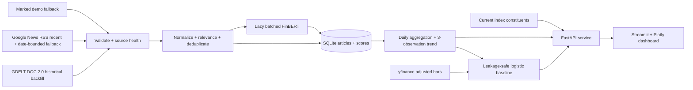

# MarketSentinel

MarketSentinel is a financial-news sentiment and market-direction research app. It combines recent
RSS headlines, FinBERT probabilities, stored daily sentiment, historical market data, and an
experimental five-trading-day direction baseline behind a FastAPI API and Streamlit dashboard.

> **Important:** MarketSentinel is an educational portfolio project, not financial advice.
> Sentiment does not itself predict prices, and the forecast is not an exact price prediction or a
> calibrated guarantee of an investment outcome.

## What phase 1 does

- Searches the current S&P 500 and FTSE 100 constituent tables, with a 24-hour local cache.
- Fetches three years of adjusted daily price/volume data with `yfinance` and displays the latest 30
  trading sessions.
- Backfills the previous 30 calendar days through the free GDELT DOC 2.0 provider, querying the
  canonical company name, controlled aliases, and ticker. It falls back to a date-bounded Google
  News RSS discovery query only when GDELT has no accepted records.
- Records a stage-by-stage ingestion funnel: retrieved, invalid dates/URLs, irrelevant, each
  deduplication reason, request-limit exclusions, database conflicts, and scoring state.
- Normalizes titles and URLs, applies transparent relevance rules, and deduplicates only by stable
  provider identifier, canonical URL, or identical normalized title + publisher within six hours.
- Lazily loads `ProsusAI/finbert`, scores new headlines in batches, and maps logits through
  `model.config.id2label` rather than assuming label order.
- Stores articles, FinBERT results, and daily aggregates in SQLite.
- Optionally extracts cached structured event facts, concrete positive and negative transmission
  channels, and a broad economic-consequence persistence horizon from genuine stored articles.
- Shows only genuine, scored historical sentiment dates, a three-observation weighted trend, and
  article coverage. It never fills a missing day with neutral sentiment.
- Produces an experimental probability that the adjusted close will be higher in five trading
  sessions, with chronological validation and visible naive baselines.
- Reports source health. An HTTP 200 with no valid records is degraded, not healthy.
- Can use clearly labelled synthetic demo headlines if live RSS is unavailable; tests never require
  network access or the real model.

## Data honesty

GDELT and the Google News fallback return genuine provider records, but neither is a complete,
licensed historical-news archive. MarketSentinel therefore does **not** manufacture a 30-day
sentiment series:

- The company chart supports 1M, 3M, 6M, and 1Y calendar windows, with 6M as the default.
- Price, FinBERT sentiment, and meaningful stored event analyses can be viewed together or separately.
- Sentiment displays only dates backed by available scored articles.
- SQLite retains accepted articles, FinBERT scores, and daily aggregates, so the chart becomes
  richer through actual use.
- Missing sentiment dates are not backfilled with invented values.
- The forecast begins as a price/volume baseline. Sentiment features activate only after at least 10
  stored sentiment dates are present, and the UI reports the exact coverage.

The Google fallback prefers a resolved publisher URL. If Google consent blocks that resolution, it
retains the genuine Google RSS item link and says so in source health; it never invents a publisher
URL. It is always labelled as partial/non-archival coverage. A later phase should add a properly
licensed historical-news source and use walk-forward experiments to measure whether sentiment
improves out-of-sample performance over price-only baselines.

The dashboard's ingestion diagnostics distinguish an upstream coverage limitation from a local
filtering decision. In particular, `Excluded by request limit` means the provider produced more
validated unique candidates than the caller asked to retain; it is not a duplicate or relevance
rejection.

## Architecture



The package follows a `src/` layout with explicit boundaries:

```text
src/marketsentinel/
├── aggregation/       # Daily sentiment and moving averages
├── api/               # FastAPI boundary and dependency wiring
├── forecasting/       # Chronological five-session baseline
├── sentiment/         # Lazy FinBERT service
├── sources/           # RSS and market-data adapters
├── storage/           # SQLite repository
├── constituents.py    # Current universe discovery/cache
├── dashboard.py       # Streamlit client
├── domain.py          # Pydantic domain contracts
├── normalization.py   # Relevance and deduplication
└── service.py         # End-to-end orchestration
```

## Scoring and aggregation

FinBERT returns positive, negative, and neutral probabilities. For headline `i`, MarketSentinel
defines a signed sentiment index:

```text
s_i = P(positive_i) - P(negative_i), where -1 <= s_i <= 1
```

This is a derived index, not a probability of price movement. The code reads the probability indices
from the model configuration. For `ProsusAI/finbert`, the published mapping is positive at index 0,
negative at index 1, and neutral at index 2; a regression test protects this historically error-prone
boundary.

For an article age `a_i` in hours, relevance score `r_i`, configurable half-life `h` (24 hours by
default), and FinBERT probability entropy `H(p_i)`, the confidence and weight are:

```text
confidence_i = 1 - H(p_i) / log(3)
lambda = log(2) / h
w_i = r_i * confidence_i * exp(-lambda * a_i)
S_t = sum(w_i * s_i) / sum(w_i)
```

For each calendar date with genuine scored articles, the API also returns article count, weighted
positive and negative probability shares, and weighted disagreement (the weighted standard deviation
of headline-level signed scores). The visual trend is a three-observation, aggregate-weighted mean;
it uses the three most recent observed dates, not invented calendar rows. Dates with no articles are
absent rather than silently imputed as neutral.

## Experimental forecast

The target at trading session `t` is:

```text
y_t = 1 if adjusted_close_(t+5) > adjusted_close_t, otherwise 0
```

Features use only information available at `t`:

- One- and five-session trailing returns
- Ratios to five- and 20-session moving averages
- Ten-session annualized volatility
- Five-session relative volume
- Daily sentiment, seven-day sentiment average, and article count when coverage is sufficient

The model is a regularized logistic regression with median imputation and standardization. The newest
20% of labelled observations (at least 30) form a chronological validation window. A five-session
purge separates training from validation so no training label reaches into validation dates; there is
no random time-series split. Daily sentiment is conservatively assigned to the next observed trading
session, preventing an after-close headline from becoming a same-close feature. The dashboard compares
accuracy with a training-majority classifier and a simple trailing-momentum rule, then refits on all
matured labels for the current estimate.

The output probability is **not calibrated**. A future evaluation should use walk-forward splits,
probability calibration, multiple market regimes, transaction-cost-aware decision rules, and a
licensed historical sentiment dataset.

## Run locally

Requirements: [uv](https://docs.astral.sh/uv/) and Python 3.11. Docker is not required for phase 1.

```powershell
git clone <your-repository-url>
cd MarketSentinel
uv sync --dev
Copy-Item .env.example .env
```

Start the API and dashboard together from one PowerShell session. Both processes load the same
working-directory `.env` configuration:

```powershell
.\scripts\run_local.ps1
```

Open `http://localhost:8501`. API documentation is available at `http://127.0.0.1:8000/docs`.

The first analysis that has unscored articles downloads the public `ProsusAI/finbert` model and may
take longer. The model is loaded once per API process. No Hugging Face token is required for this
public model.

## Configuration

Settings use the `MARKETSENTINEL_` prefix and may be placed in `.env`. See `.env.example` for the full
starter configuration.

| Setting | Default | Purpose |
| --- | --- | --- |
| `DATABASE_PATH` | `data/marketsentinel.db` | Local SQLite runtime database |
| `FINBERT_MODEL` | `ProsusAI/finbert` | Hugging Face model identifier |
| `FINBERT_DEVICE` | `auto` | CPU/CUDA selection; CPU is the default fallback |
| `FINBERT_BATCH_SIZE` | `8` | Inference batch size |
| `NEWS_LOOKBACK_DAYS` | `7` | RSS recency window |
| `NEWS_MAX_ARTICLES` | `50` | Maximum articles per analysis |
| `HISTORICAL_NEWS_DAYS` | `30` | Calendar range passed to the historical provider |
| `HISTORICAL_NEWS_MAX_ARTICLES` | `180` | Maximum accepted historical articles per analysis |
| `HISTORICAL_GDELT_WINDOW_DAYS` | `30` | One bounded GDELT query span (shorten only if needed) |
| `HISTORICAL_GDELT_REQUEST_INTERVAL_SECONDS` | `5.25` | Public GDELT request pacing |
| `ALLOW_DEMO_FALLBACK` | `true` | Permit visibly labelled synthetic fallback headlines |
| `LLM_API_KEY` | unset | Enables manual and bounded automatic typed OpenAI article-intelligence stages |
| `LLM_MODEL` | `gpt-4o-mini` | OpenAI model used by all three intelligence stages |
| `ANALYSIS_AUTO_CANDIDATES` | `15` | Maximum deterministically selected articles considered per explicit company analysis |
| `ANALYSIS_AUTO_MAX_NEW_PER_RUN` | `6` | Maximum uncached article-analysis attempts per run; set to `0` to disable automatic inference |

The `.env`, SQLite databases, model caches, virtual environments, and provider caches are ignored by
Git. API credentials can be added to the settings/provider boundary later; they must never be
committed.

## API

```text
GET  /health
GET  /api/v1/constituents/search?q=Apple&market=S%26P%20500&limit=20
POST /api/v1/analyze
```

Example request:

```powershell
Invoke-RestMethod `
  -Method Post `
  -Uri http://127.0.0.1:8000/api/v1/analyze `
  -ContentType application/json `
  -Body '{"symbol":"AAPL"}'
```

## Quality checks

```powershell
uv run ruff check .
uv run ruff format --check .
uv run pytest --cov=marketsentinel --cov-report=term-missing
```

Tests inject fake providers and a static sentiment backend, so CI is deterministic and does not fetch
live data or download model weights. The suite covers FinBERT label mapping, normalization,
deduplication, recency weighting, calendar-window aggregation, SQLite round-trips, sparse-sentiment
gating, chronological forecast targets, and the complete service orchestration path.

## Known limitations

- GDELT and Google News RSS are free discovery sources, not complete historical-news archives. GDELT
  can rate-limit or return malformed/non-JSON responses; the dashboard displays that health failure
  and the date-bounded RSS fallback remains explicitly partial.
- The relevance stage is transparent and testable but still title-based and imperfect, especially for
  short or ambiguous tickers.
- The historical RSS fallback prefers direct publisher URLs. Google consent can block resolution, in
  which case the app retains the real Google RSS item URL and marks it as an unresolved redirect.
  Different publishers can still describe the same event with different titles.
- The constituent list depends on validated Wikipedia table structure. A cached or small offline
  fallback is clearly identified if refresh fails.
- `yfinance` is suitable for a portfolio demonstration, not a contractual production market-data
  feed.
- Sentiment probabilities describe text tone. They are not calibrated probabilities of price moves.
- Forecast validation is a baseline diagnostic, not evidence of a tradable strategy. Backtests do not
  guarantee future performance.
- Demo headlines are synthetic, always marked, and never presented as real news.

## Next engineering steps

1. Add a licensed historical-news provider behind the existing adapter interface and evaluate
   backfill completeness against it.
2. Compare price-only and price-plus-sentiment models with walk-forward evaluation and confidence
   intervals.
3. Add a small opt-in real-model integration test and a labelled financial-language evaluation.
4. Add scheduled ingestion so SQLite collects daily observations without manual searches.
5. Add Docker packaging and deployment configuration after the local product flow is stable.
6. Capture dashboard screenshots and publish a short reproducible demo.
